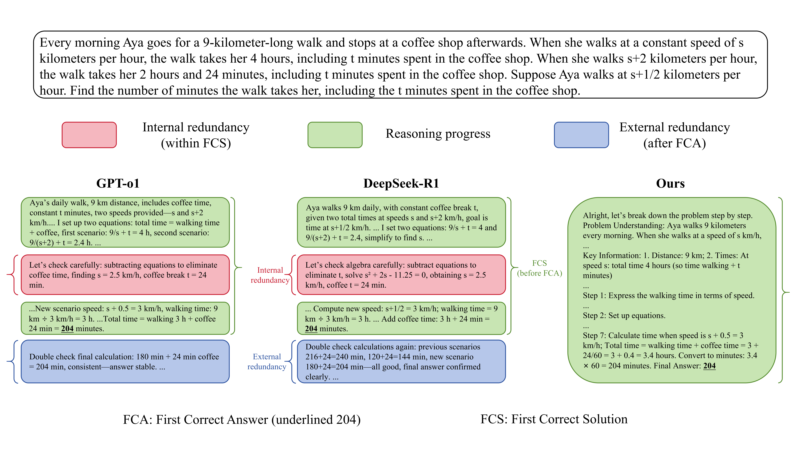
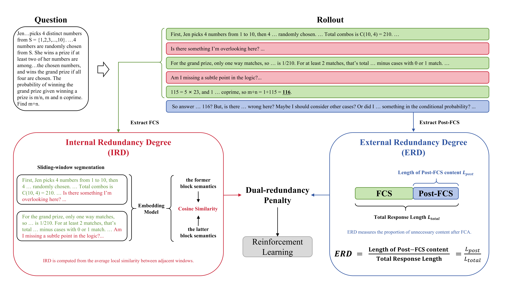

<div align="center">

# Reconsidering Overthinking: Penalizing Internal and External Redundancy in CoT Reasoning

[](LICENSE)
[](setup.py)
[](scripts/deepscaler/train)

</div>

This repository contains the official implementation of **Reconsidering Overthinking: Penalizing Internal and External Redundancy in CoT Reasoning**. The project studies why large reasoning models generate unnecessarily long Chain-of-Thought (CoT) traces and proposes a reinforcement learning objective that compresses reasoning by targeting two different redundancy sources:

- **Internal redundancy**: low-progress, semantically repetitive reasoning before the first correct answer.
- **External redundancy**: unnecessary continuation after the first correct answer has already appeared.

Instead of treating all tokens as equally compressible, the method separates reasoning progress from termination behavior. This makes CoT compression more faithful than a single global length penalty.



## Method



Given a generated reasoning trace, we locate the first sentence that contains the correct final answer:

```text
Question -> reasoning before FCA -> First Correct Answer -> post-answer continuation
            \____________________/                         \______________________/
                     FCS                                      external redundancy
```

The reward keeps correctness as the primary objective. Redundancy penalties are applied only to correct responses:

```text
R_total = R_acc * p_int * p_ext
```

where:

- `p_int` penalizes excessive local semantic similarity inside the FCS.
- `p_ext = 1 - ERD` penalizes unnecessary continuation after the FCA.
- Incorrect responses receive zero or format-error reward according to the reward configuration.


## Repository Structure

```text
.
|-- rllm/
|   |-- data/                         # Dataset
|   |-- rewards/                      # Dual-redundancy reward
|   |   `-- compress_utils/           # FCA splitting, IRD utilities, embedding service
|   |-- tools/                        # Optional tool-use utilities
|   `-- system_prompts.py             # Prompt templates
|-- scripts/
|   |-- data/                         # Dataset conversion scripts
|   |-- deepscaler/train/             # Training scripts
|   |-- eval/                         
|   |-- pipeline/                     
|   `-- sft/                          
|-- tests/                            
|-- verl/                             
|-- setup.py
`-- LICENSE
```

## Installation

The training stack is designed for CUDA-enabled Linux environments. The paper experiments use multi-node A800 GPUs; smaller runs may require reducing batch size, response length, tensor parallelism, or number of sampled responses.

```bash
conda create -n overthink python=3.10 -y
conda activate overthink

# Required by the vLLM version used in this project.
git clone https://github.com/ozeliger/pyairports.git
cd pyairports
pip install -e .

# Install this repository.
cd Reconsidering-Overthinking
pip install -e ./verl
pip install -e .
```


## Data Preparation

Convert the bundled/raw dataset definitions into the parquet format expected by `verl`:

```bash
python scripts/data/deepscaler_dataset.py --local_dir ~/rllm/data
```

This creates files such as:

```text
~/rllm/data/deepscaler_train.parquet
~/rllm/data/aime.parquet
~/rllm/data/math.parquet
~/rllm/data/gsm8k.parquet
```

During training, numeric-answer filtering is applied so the reward can reliably identify the FCA and split the generated trace into FCS and post-FCS continuation.

## Training

The main scripts are in [`scripts/deepscaler/train`](scripts/deepscaler/train):

```bash
scripts/deepscaler/train/deepscaler_1.5b_compress.sh
scripts/deepscaler/train/deepscaler_7b_compress.sh
```

## Evaluation

Edit `CODE_DIR` and `MODEL_PATH` in [`scripts/eval/eval_model.sh`](scripts/eval/eval_model.sh), then run:

```bash
bash scripts/eval/eval_model.sh \
  --model /path/to/checkpoint \
  --datasets aime math gsm8k \
  --output-dir eval_output/my_model \
  --max-length 16384
```

Generated outputs are saved as parquet files under the chosen output directory.
